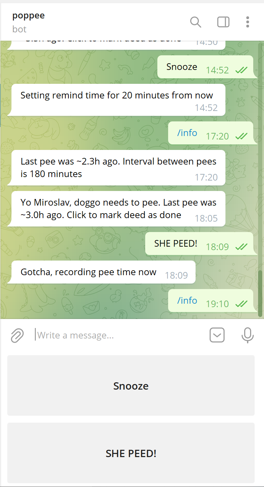

# Poppee service

## Intro
A Telegram bot that keep track of when your dog last did her business and reminds you. This started as a joke but we actually find it useful day-to-day, so I'm open-sourcing it in the hope that some else likes it too. The main design goal is simplicity over anything else. Not even tests. It is a single Python file with minimal dependencies. All data is stored in a local SQLite DB and can be self hosted. I host it on a Raspberry Pi Zero, which is plenty fast for such an app.

## Installation:
 - use [Telegram Botfather](https://core.telegram.org/bots) to create a bot and an access token for it
 - write a JSON file called `.env` in the root of this repo containing your access token: `{"telegram_poppee": "1234:ABCDEFG"}` 
 - install python > 3.6 and the bot's dependencies on your server: `pip install -r requirements.txt`
 - edit the constants at the top of the Python file to customise how often your dog needs to pee and how often you want to be notified
 - setup the bot to run as a systemd service: `sudo cp poppee.service /lib/systemd/system/`
 - start the service: `sudo systemctl restart poppee.service`
 - find the bot on Telegram from your phone/laptop and message it `/help` to see usage info
 - the most important command is `/sub` or `/start` - to subscribe for notifications when the dog is due
 - when you are out and about, click ´SHE PEED´ to record the time or ´SNOOZE´ to give yourself more time before the next reminder

 That's it!

 ## Why is it called Poppee
 Because my puppy is called Poppy and she pees a lot. Also, I made sure to use the `peewee` library.

 ## Why Telegram

 Messaging apps are the easiest cross-platform way to send a push notification a device and receive a basic response back. Building a mobile/desktop app is easy but would have worked been much more work. Out of all the messaging apps I use, Telegram has the simplest API.
 
 ## Example
 
 
